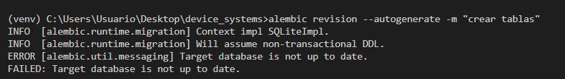
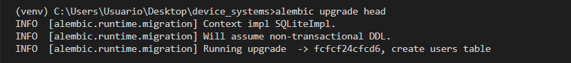
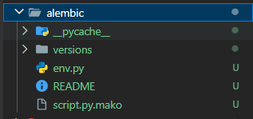
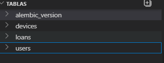
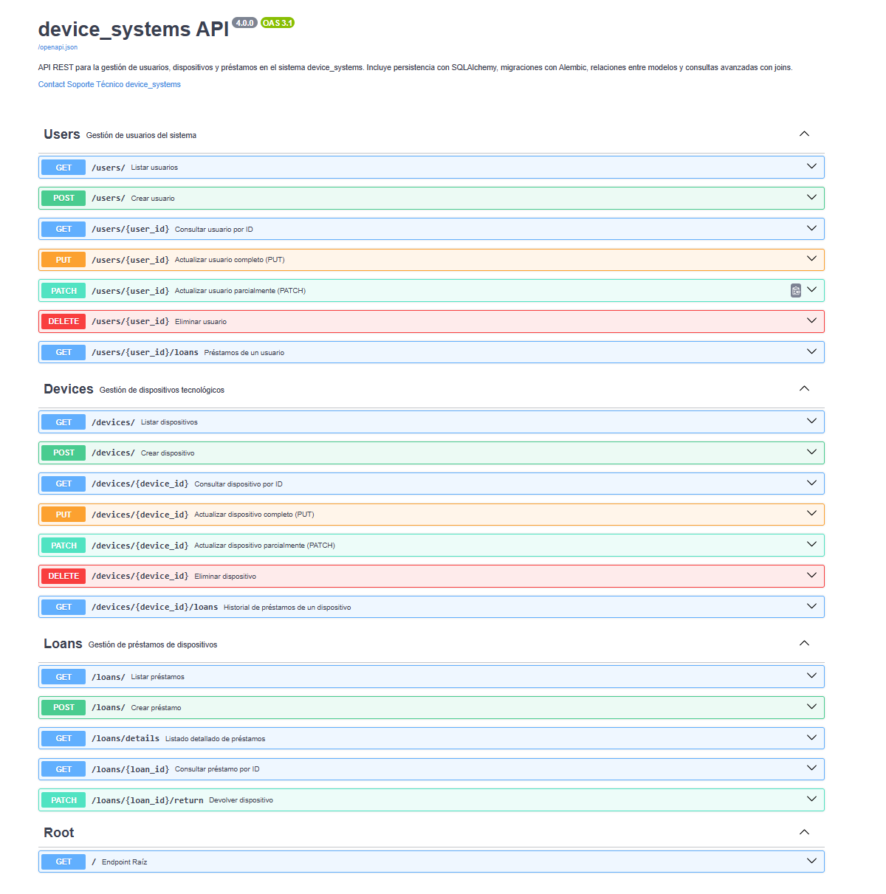

# Device Systems API

## Información del Proyecto

API REST desarrollada con FastAPI para la gestión de usuarios, dispositivos y préstamos, implementando migraciones con Alembic, relaciones entre entidades mediante SQLAlchemy y consultas avanzadas.

---

# Tecnologías Utilizadas

* Python
* FastAPI
* SQLAlchemy
* SQLite
* Alembic
* Pydantic
* Swagger UI

---

# Enlace del Video de Sustentación

(https://youtu.be/1okLCFRy-gQ)

---

# Evidencia 1. Inicialización de Alembic

Se inicializó Alembic para administrar las migraciones de la base de datos.

```bash
alembic init alembic
```

### Evidencia


---

# Evidencia 2. Creación de Migraciones

Se generó la migración automáticamente a partir de los modelos definidos en el proyecto.

```bash
alembic revision --autogenerate -m "crear tablas"
```

### Evidencia



---

# Evidencia 3. Aplicación de Migraciones

Se aplicó la migración a la base de datos.

```bash
alembic upgrade head
```

### Evidencia



---

# Evidencia 4. Carpeta Generada por Alembic

Se verifica la estructura creada por Alembic dentro del proyecto.

### Evidencia



---

# Evidencia 5. Estructura de Tablas Generadas

Se verifica la correcta creación de las tablas en la base de datos.

### Tablas principales

* users
* devices
* loans

### Evidencia



---

# Evidencia 6. Swagger UI

Se verifica el correcto funcionamiento de la documentación automática de FastAPI.

### URL

```text
http://127.0.0.1:8000/docs
```

### Evidencia



---

# Relaciones Implementadas

## User - Loan

Un usuario puede tener múltiples préstamos.

```text
User (1) -------- (N) Loan
```

## Device - Loan

Un dispositivo puede estar asociado a múltiples préstamos a lo largo del tiempo.

```text
Device (1) -------- (N) Loan
```

---

# Importancia de las Migraciones

Las migraciones permiten controlar los cambios realizados en la estructura de la base de datos de forma organizada y segura. Gracias a Alembic es posible versionar el esquema de la base de datos, aplicar cambios de manera controlada y mantener consistencia entre los diferentes entornos de desarrollo.

---

# Importancia de las Relaciones

Las relaciones entre entidades permiten representar situaciones reales dentro del sistema. En este proyecto, la relación entre usuarios, dispositivos y préstamos facilita la administración de los recursos y mantiene la integridad de los datos.

---

# Importancia de las Consultas Avanzadas

Las consultas avanzadas mediante joins y filtros permiten obtener información consolidada de varias tablas, optimizando el acceso a los datos y mejorando el rendimiento de la aplicación.

---

# Conclusiones

* Se implementó correctamente Alembic para el manejo de migraciones.
* Se generaron y aplicaron migraciones exitosamente.
* Se verificó la creación de las tablas en la base de datos.
* Se validó el funcionamiento de Swagger UI.
* Se fortalecieron los conocimientos sobre modelado relacional y consultas avanzadas en APIs REST.
