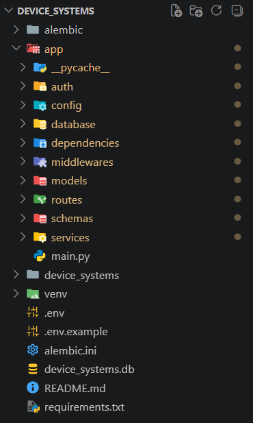
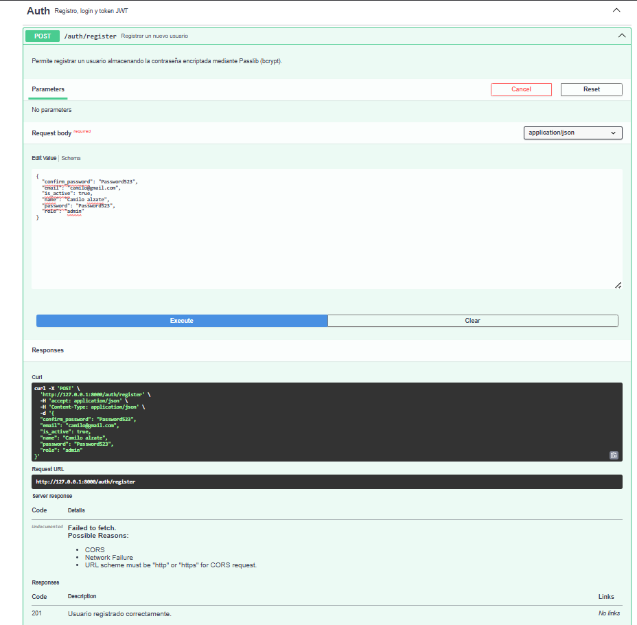
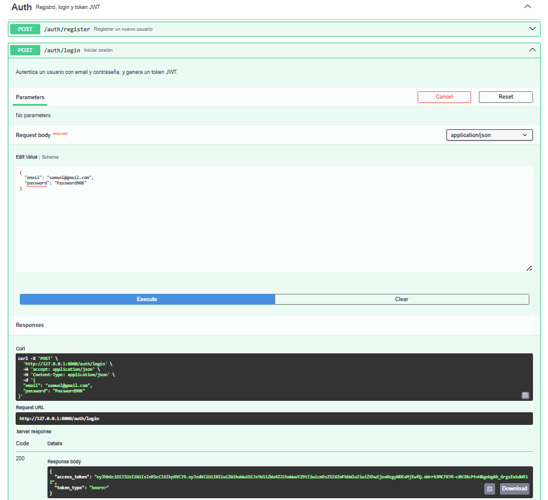
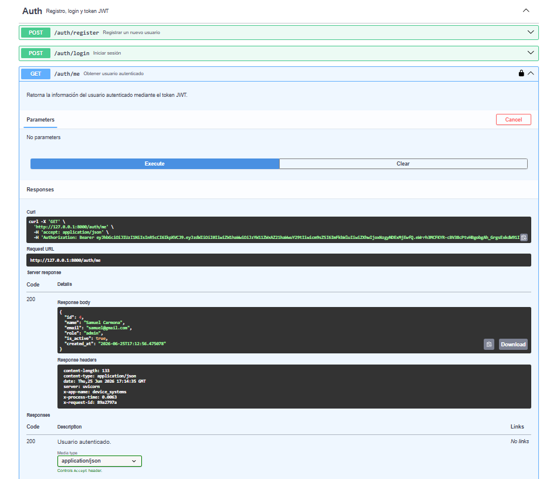
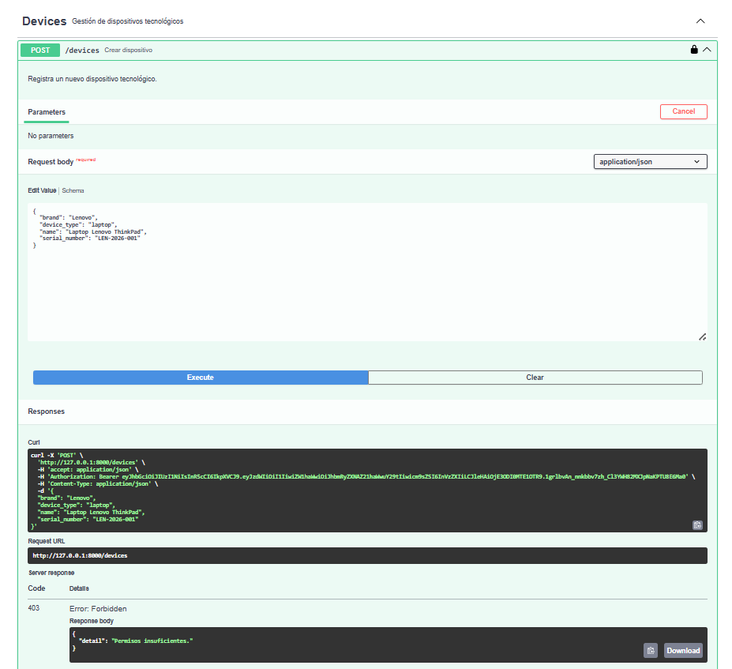
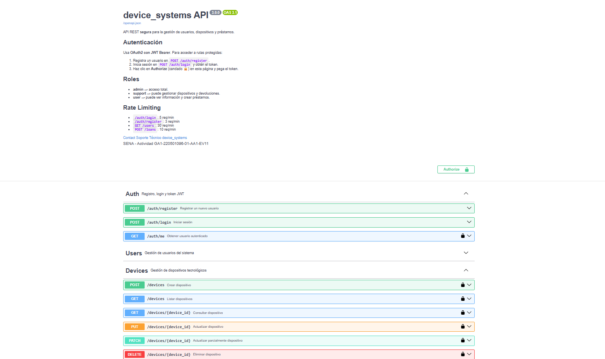
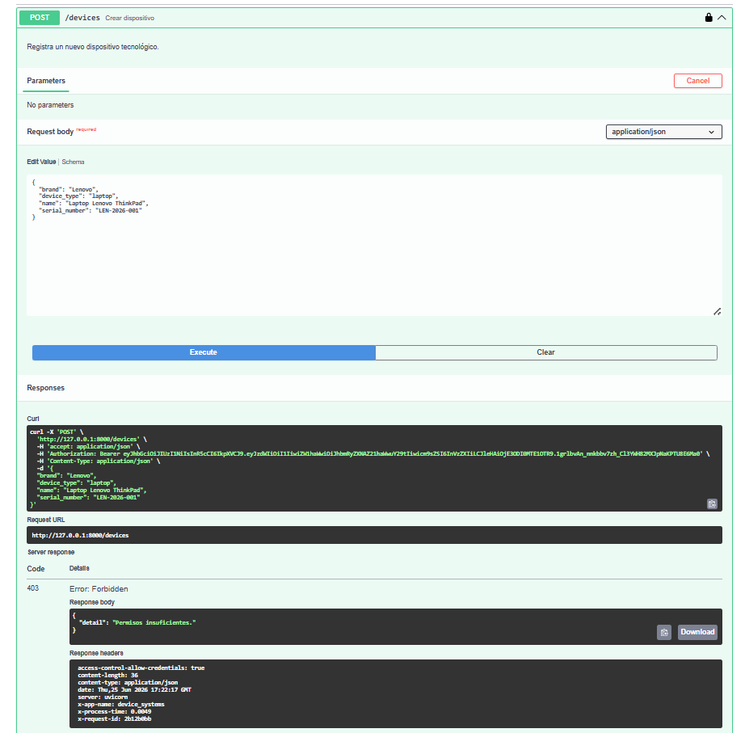
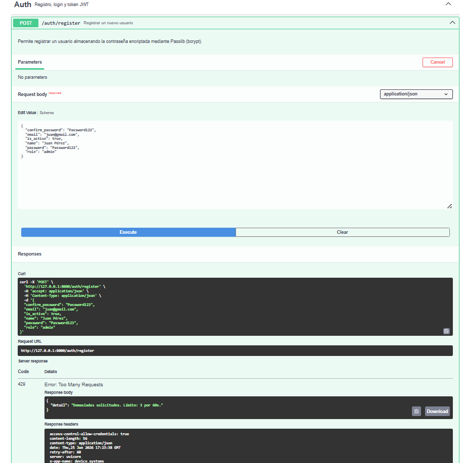

# Sistema de Gestión de Dispositivos - Device Systems

Este proyecto consiste en una API REST robusta y escalable desarrollada con el framework **FastAPI**. Utiliza **SQLAlchemy** como ORM para la persistencia de datos y **Alembic** para el control de versiones y la gestión automatizada de las migraciones de la base de datos. 

El sistema implementa un esquema de seguridad avanzado que incluye autenticación basada en **OAuth2 con JWT (JSON Web Tokens)**, control de acceso basado en roles (RBAC), middlewares de optimización y seguridad, protección CORS y políticas de mitigación de abusos mediante Rate Limiting.

---

## 🚀 Evidencias de Desarrollo y Funcionamiento

A continuación se presentan las capturas de pantalla que documentan el ciclo de vida del desarrollo, la arquitectura del proyecto y las pruebas de seguridad aplicadas a los endpoints.

### 1. Estructura del Proyecto
Organización limpia y modular del código fuente siguiendo las buenas prácticas de FastAPI. Se aprecian los directorios principales como `app`, `routers`, `models` y `schemas`.

### 2. Migración Alembic Aplicada
Evidencia del control de versiones de la base de datos. Se generó la revisión automática mediante el comando `--autogenerate` y se aplicó con éxito ejecutando `upgrade head`.

### 3. Registro de Usuario
Prueba de inserción de un nuevo registro en la base de datos a través de un endpoint `POST`. El servidor procesa el payload y retorna un estado `201 Created`.

### 4. Login y Token Generado
Demostración del flujo de autenticación OAuth2. Al enviar credenciales válidas, el backend genera y retorna un `access_token` firmado (JWT) con su respectivo tipo de portador (`bearer`).

### 5. Consulta de Usuario Actual (`/auth/me`)
Validación del estado de la sesión. Al incluir el Bearer Token en las cabeceras de la petición, el endpoint protegido descodifica la identidad del usuario activo y expone sus datos.

### 6. Acceso sin Token (401 Unauthorized)
Prueba de seguridad perimetral. Cualquier intento de consumir una ruta protegida sin adjuntar el token de autenticación es rechazado inmediatamente con un código `401`.

### 7. Acceso con Rol No Permitido (403 Forbidden)
Validación del Control de Acceso Basado en Roles (RBAC). Un usuario autenticado pero con privilegios comunes intenta acceder a un endpoint exclusivo de Administrador, disparando una excepción `403`.

### 8. Interfaz de Swagger/OpenAPI con OAuth2
Vista general de la documentación interactiva provista por FastAPI, donde se resalta el flujo global de autorización mediante el botón "Authorize" y los candados de protección.

### 9. Cabeceras del Middleware (Response Headers)
Inspección técnica de los encabezados devueltos por el servidor. Se evidencia el ciclo de vida de la petición controlado por middlewares personalizados (métricas de tiempo, IDs de rastreo y metadatos de la app).

### 10. Prueba de Rate Limiting (429 Too Many Requests)
Mecanismo de defensa contra ataques de denegación de servicio (DoS) o fuerza bruta. Tras lanzar peticiones masivas en ráfaga, el limitador bloquea temporalmente al cliente con un estado `429`.

---

## Configuración de CORS (Cross-Origin Resource Sharing)

El intercambio de recursos de origen cruzado (CORS) es un mecanismo de seguridad fundamental implementado en esta API a través de un middleware nativo de FastAPI (`CORSMiddleware`). 

Como se observa en la inspección de cabeceras de las pruebas, el servidor inyecta explícitamente:
`access-control-allow-credentials: true`

### ¿Cómo funciona en nuestra API?
1. **Restricción y Control:** Permite declarar con precisión qué dominios externos (orígenes) tienen autorización para realizar peticiones HTTP hacia nuestro backend.
2. **Soporte de Credenciales:** Al establecer `allow_credentials=True`, habilitamos de manera segura que las aplicaciones frontend autorizadas puedan transmitir cookies, cabeceras de autorización (Authorization Headers) o certificados de cliente TLS.
3. **Métodos y Cabeceras:** Regula estrictamente si el cliente puede usar métodos como `POST`, `GET`, `PUT` o `DELETE`, protegiendo la API de llamadas maliciosas provenientes de sitios web de terceros no mapeados en la lista blanca (*allowlist*).

---

## Reflexión Final: La Importancia de la Seguridad en APIs REST

En el ecosistema del desarrollo de software moderno, las APIs actúan como las puertas de acceso directas a los datos y a la lógica de negocio de las organizaciones. Por lo tanto, construir una API que sea puramente funcional pero carezca de directrices de seguridad sólidas representa un riesgo crítico e inaceptable.

A lo largo del diseño e implementación de **Device Systems**, se ha demostrado que la seguridad no debe ser una capa superficial añadida al final del desarrollo, sino un pilar arquitectónico integrado desde el primer día:

* **Confidencialidad e Identidad:** Herramientas como OAuth2 y JWT garantizan que solo las entidades plenamente identificadas puedan interactuar con la información, evitando la exposición accidental o malintencionada de datos sensibles.
* **Granularidad (RBAC):** Autenticar no es lo mismo que autorizar. Controlar el acceso mediante roles asegura el principio de *menor privilegio*, donde cada usuario ejecuta estrictamente lo que su rol académico o administrativo le permite.
* **Resiliencia del Servidor:** Tecnologías como el Rate Limiting y la correcta inyección de cabeceras de middleware protegen la infraestructura contra abusos automatizados, scripts maliciosos y ataques de denegación de servicio, garantizando la alta disponibilidad del sistema para los usuarios legítimos.

En conclusión, asegurar una API REST es salvaguardar la integridad de la aplicación, proteger los activos de información y asegurar una experiencia digital confiable, estable y alineada con los estándares internacionales de la industria del software.

[Ver video de demostración en YouTube](https://youtu.be/ICStl4igfZw)